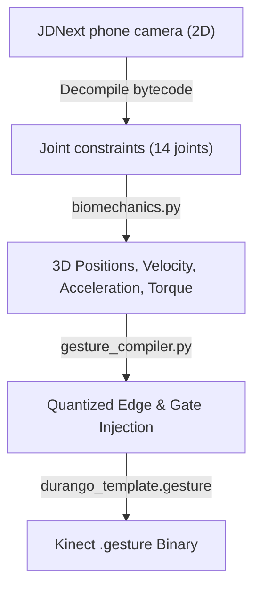

# context-package: CAMERA_TO_KINECT_AI_JUDGE_CONTEXT
# Role: AI Auditing Judge & Second-Opinion Consultant
# Target Code: jd2021-map-installer/jd2021_installer/installers/gesture_compiler.py

Use this document to prime any advanced AI (such as Gemini 1.5 Pro, Claude 3.5 Sonnet, or GPT-4o) with the exact technical context, mathematical foundations, and code architecture of the Just Dance Camera-to-Kinect Translation Pipeline, allowing them to perform an independent audit and provide a second opinion on our findings.

---

## 1. System Architecture Briefing

Just Dance maps from 2023 onwards (JDNext) record player actions using a smartphone camera (2D coordinate stream). Just Dance 2021 on PC uses the Xbox One Kinect tracking engine, which evaluates actions using an **AdaBoost Decision Stump Ensemble** of 1000 "edges" grouped in state layers.

Our task is to convert the 2D phone camera coordinate streams into legacy Kinect binary files (`.gesture` format) while keeping the game's scoring difficulty natural, responsive, and exploit-free.



---

## 2. Technical Parity & Biomechanics

### 2.1 Skeletal Downsampling
The phone camera regresses 33 MediaPipe BlazePose landmarks, which are downsampled via interpolation to **15 Kinect V1 joints**:
*   `0`: HipsCenter (midpoint L/R hips)
*   `1`: ShouldersCenter (midpoint L/R shoulders)
*   `2-14`: Symmetrical shoulder, elbow, wrist, hip, knee, and ankle joints. (Nose `0` is omitted in gesture curves).

### 2.2 Biomechanical Simulation (`biomechanics.py`)
To map the 2D pixel coordinates `[-1.0, 1.0]` to the Kinect's 3D physical meters `[-3.8, 3.8]`, the pipeline runs a Forward Kinematics engine:
1.  **Z-Depth Recovery:** Analytically estimates joint depth using rigid bone constraints relative to a standard $1.7\text{m}$ human height.
2.  **Kinematics Derivatives:** Computes velocity, acceleration, speed, and speed-squared using a noise-dampening Savitzky-Golay filter.
3.  **Inverse Dynamics:** Approximates joint torques and muscle forces.

### 2.3 AdaBoost Stump Matcher
Each Kinect edge (12 bytes) executes a single-feature threshold test (decision stump):
```
struct Edge {
  float threshold_a;    // Classifier weight coefficient OR gating joint pair ID
  float threshold_b;    // Expected kinematic target value
  int32 state_id;       // Associated active state machine frame
}
```
*   **Scoring Edges** ($|t_a| \le 1.0$): Adds gradient-based score values if physical features pass $t_b$.
*   **Gating Edges** ($|t_a| > 10.0$): Acts as hard binary pass/fail vetoes. If failed, the move instantly misses.
*   **Classifiers (ETypes):** Range from EType 0 (Position), EType 3 (Angular velocity), EType 8-10 (Velocity axes), EType 25-27 (Acceleration axes), to torque and muscle forces.

---

## 3. The Core Target of Your Audit (The Code Gaps)

You are asked to audit the pipeline script **`gesture_compiler.py`** and evaluate our findings regarding the following critical issues.

### 3.1 🔴 Issue 1: The Gating Padding Omission Bug
*   **The Problem:** Some converted maps are extremely "miss-heavy", meaning players get consecutive "Misses" even when dancing correctly.
*   **Where to inspect:** `gesture_compiler.py` inside the main `compile_hybrid_gesture()` loop.
*   **The Bug Logic:**
    ```python
    # Pass 1: Identify if the edge was gating in the original template
    is_gating = (abs(ta) > 10.0)  # <-- Based on original template ta coefficient!
    ...
    # Later inside the injection loop:
    padding = max(abs(expected) * 0.4, 0.25)
    if is_gating:
        padding *= 2.0  # <-- Double padding is ONLY given to original gating edges!
    ...
    # At the end of the loop, scoring edges on structural joints are promoted to gating:
    if not is_gating:
        if jdnext_joint in structural_joints:
            ta_val = 15.0 if ta > 0 else -15.0  # <-- Promoted to strict veto gate!
    ```
*   **Audit Task:** Confirm if this is a logic bug. If we promote a lenient scoring edge to a strict gating veto (`ta_val = 15.0`) but leave it with a narrow scoring padding (because `is_gating` was evaluated as `False`), does the player get penalized with unfair vetoes for slight movement variance? What is the correct fix?

### 3.2 🟡 Issue 2: Static Variance Thresholding
*   **The Problem:** Graceful/slow lyrical choreographies suffer from poor recognition and chaotic gating joint classification, while fast energetic tracks have too many constraints.
*   **Where to inspect:** `gesture_compiler.py` lines 870–895.
*   **The Logic:**
    ```python
    structural_joints = {
        jid for jid, var in joint_variances.items() 
        if var > (mean_variance + 0.5 * std_variance)
    }
    ```
*   **Audit Task:** Evaluate if using a flat static threshold ($0.5 \times \text{std\_variance}$) causes slow songs (low joint variance) to incorrectly promote noisy, minor joint fluctuations into hard vetoes. Design an adaptive activity coefficient $k$ to scale based on the speed profile.

### 3.3 🟡 Issue 3: Flat Dead-Zone Filtering
*   **The Problem:** Subtle hand and arm placements close to the body center are filtered out entirely, causing tracking fallbacks.
*   **Where to inspect:** `gesture_compiler.py` lines 90–94, and 606–628.
*   **The Logic:**
    ```python
    _DEAD_ZONE_MAX = 0.14
    filtered = [(jid, v) for jid, v in joint_constraints if abs(v) > dead_zone]
    ```
*   **Audit Task:** Evaluate if a hard limit of `0.14` across all joints and tracks is too aggressive. How can this noise filter be made adaptive or per-joint?

### 3.4 🟢 Issue 4: Scale Constant Disparity
*   **The Problem:** Conflicting coordinate scale constants `_JDNEXT_TO_DURANGO_SCALE = 1.97` vs `_CAM_TO_KINECT_SCALE = 2.28` exist in the compiler.
*   **Audit Task:** Forensic standard-deviation mapping from console assets supports $2.28\times$ as the true position standard-deviation ratio. Confirm if consolidating around $2.28\times$ is correct, and where it should be applied.

---

## 4. Instructions for the Auditing AI

When auditing this pipeline, please address the following questions:

1.  **Do you agree with the Gating Padding Omission finding?**
    *   Inspect `gesture_compiler.py` and confirm if newly promoted synthetic gating edges (`ta_val = 15.0`) are left with narrow, scoring-grade bounds due to the stale `is_gating` boolean evaluation. Provide the exact code replacement block to fix it.
2.  **How would you implement the Adaptive Variance threshold?**
    *   Propose a mathematical model and a clean python replacement block for calculating `structural_joints` that automatically adapts to both slow/lyrical songs and fast/energetic tracks.
3.  **Is there dead code to prune?**
    *   Confirm if `_compile_with_donor()` and `_build_edge_table()` can be safely deleted if `compile_hybrid_gesture()` is our sole canonical conversion path.
4.  **Are there any other hidden bugs, scale disparities, or structural risks in the pipeline?**
    *   Review the file structures and provide any additional recommendations to improve scoring stability on Kinect.
